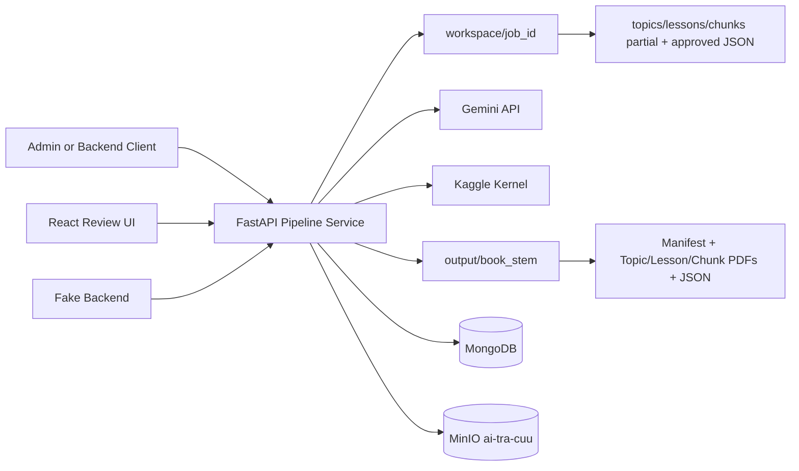

# Architecture

## Purpose

`gemini-pdf-pipeline-service` is a standalone review-first PDF processing service. It was extracted from the old in-repo `gemini_pipeline` workflow so other backend projects can use the PDF pipeline through HTTP APIs instead of subprocess calls and old backend imports.

The service focuses on producing reviewable textbook artifacts:

- topic, lesson, and chunk metadata
- topic, lesson, and chunk PDFs
- final old-compatible output bundles
- optional keyword JSON files
- optional Kaggle OCR/cutline post-processing for existing chunk PDFs
- Metadata-Edu MongoDB import documents
- MinIO PDF assets for subject, topic, lesson, and chunk documents

## Why Review First

The primary workflow is `review_first` because Gemini extraction can be wrong and should be inspected before data becomes canonical.

```text
PDF upload
  -> extract topics
  -> review/edit/approve topics
  -> extract lessons
  -> review/edit/approve lessons
  -> extract chunks
  -> review/edit/approve chunks
  -> prepare final bundle
  -> optional Kaggle OCR/cutline
  -> optional keyword extraction
  -> import MongoDB
```

## Components

- FastAPI pipeline service: owns job APIs, extraction orchestration, disk state, bundle preparation, and MongoDB import.
- React review UI: debug-friendly UI for creating jobs and reviewing topics, lessons, and chunks.
- Fake backend: separate FastAPI app that demonstrates integration through HTTP.
- Metadata-Edu importer: imports final bundles into MongoDB collections and uploads PDFs to MinIO.
- Kaggle postprocess adapter: optionally uploads the prepared bundle to Kaggle and applies request-specific processed output back into `output/{book_stem}`.
- Disk runtime folders: `workspace/`, `output/`, and `logs/`.

## Out of Scope

This service currently does not implement:

- PostgreSQL sync
- Neo4j sync
- production worker queue
- production authentication/authorization
- real `full_auto` mode

## Diagram



## Data Flow

```text
source.pdf
  -> topics_partial.json + Topic/ + initial Lesson/
  -> approved_topics.json
  -> lessons_partial.json + rebuilt Topic/ + rebuilt Lesson/
  -> approved_lessons.json
  -> chunks_partial.json + Chunk/
  -> approved_chunks.json
  -> output/{book_stem}/
  -> optional Kaggle postprocess of Chunk PDFs
  -> optional keyword extraction
  -> MinIO PDFs + Metadata-Edu MongoDB documents
```

## Status Lifecycle

Common statuses:

```text
uploaded
extracting_topics
reviewing_topics
extracting_lessons
reviewing_lessons
extracting_chunks
reviewing_chunks
preparing_bundle
running_kaggle
extracting_keywords
bundle_ready
importing_mongodb
mongodb_imported
error
```

`mongodb_imported` still has a readable/downloadable bundle.

## Artifact Layout

Per-job workspace:

```text
workspace/{job_id}/
  source.pdf
  job_config.json
  job_state.json
  progress.json
  result.json
  topics_partial.json
  approved_topics.json
  lessons_partial.json
  approved_lessons.json
  chunks_partial.json
  approved_chunks.json
  extraction_state.json
  kaggle_result.json
  keyword_summary.json
  mongo_import_result.json
  logs/
  {book_stem}/
```

Final output:

```text
output/{book_stem}/
  {book_stem}.json
  Topic/topic_XX/*.pdf|*.json
  Lesson/lesson_XX/*.pdf|*.json
  Chunk/{lesson_stem}/chunk_XX/*.pdf|*.json|*.keywords.json
```

Kaggle runtime artifacts:

```text
kaggle_pack/
  book_stem.txt
  run_request.json
  dataset-metadata.json
  sgk_extract/chunk_postprocess.py
  Output/{book_stem}/...

output/_kaggle_outputs/{kernel_slug}/
  downloads/
```

## Kaggle OCR/Cutline Behavior

Kaggle is optional and runs only during `prepare-bundle` after chunks already exist. It is not the initial chunk extraction step.

Enable it when creating a job with `enable_kaggle=true`. A single prepare-bundle run can override it with:

```text
skip_kaggle=true
```

Kaggle safety checks include:

- `expected_book_stem` in each request
- per-run `request_id`
- `run_request.json`
- embedded run request in the kernel script
- request-specific `current_run_status_{request_id}.json`
- `current_run_status.json` for debug compatibility
- request-specific `{book_stem}_{request_id}_postprocessed.zip`
- stale dataset mismatch detection
- stale output artifact detection
- ZIP top-level folder validation
- refusal to apply ZIP files for the wrong book stem
- bounded retry for stale dataset propagation

Kaggle results are written to:

```text
workspace/{job_id}/kaggle_result.json
workspace/{job_id}/logs/kaggle.log
```

## MongoDB Model

Collections:

```text
class
subject
topic
lesson
chunk
keyword
keyword_alias
chunk_keyword
topic_bag
asset
import_job
```

Relationships:

```text
subject.class_id -> class._id
topic.subject_id -> subject._id
lesson.topic_id -> topic._id
chunk.lesson_id -> lesson._id
asset.owner_id -> subject/topic/lesson/chunk._id
chunk_keyword.chunk_id -> chunk._id
chunk_keyword.keyword_id -> keyword._id
topic_bag.topic_id -> topic._id
```

Class, subject, topic, lesson, and chunk documents follow the Metadata-Edu shape with audit fields, `is_deleted`, and stable `import_key` values. Subject/topic/lesson/chunk documents store `asset_prefixes`; generated PDFs are uploaded to MinIO and represented by `asset` documents.

MinIO document prefixes:

```text
documents/lop-{grade}/tin-hoc/subject
documents/lop-{grade}/tin-hoc/topic/topic_{NN}
documents/lop-{grade}/tin-hoc/lesson/topic_{NN}-lesson_{NN}
documents/lop-{grade}/tin-hoc/chunk/topic_{NN}-lesson_{NN}-chunk_{NN}
```

Idempotency keys:

```text
class/subject/topic/lesson/chunk: import_key
asset: object_key
keyword: keyword_slug
keyword_alias: keyword_id + alias_norm
chunk_keyword: chunk_id + keyword_id
topic_bag: topic_id
```

## Gemini Key Rotation

Gemini keys are loaded from `.env` by `GEMINI_API_KEYS` or `GEMINI_API_KEY_1`, `GEMINI_API_KEY_2`, etc. Runtime state is persisted at:

```text
workspace/gemini_rotation_state.json
```

The key manager tracks current key index, cooldowns, dead keys, and last errors. API responses never return raw keys.

## Keyword Behavior

Keyword extraction is optional and resumable:

- successful non-empty `.keywords.json` files are reused
- empty or placeholder keyword files are retried
- errored keyword files are retried
- `skip_keywords=true` prepares and validates the bundle without Gemini calls
- `retry_failed_keywords_only=true` is available for later retry

MongoDB import does not fail if keywords are incomplete. It imports real keywords only and skips empty/error files.

## Verified Job

Verified real job:

```text
7f243448-4e57-4133-9137-f7a87c5030fc
```

Verified counts:

```text
topics=7
lessons=31
chunks=70
topic_pdfs=7
lesson_pdfs=31
chunk_pdfs=70
mongodb: class=1 subject=1 topic=7 lesson=31 chunk=70 keyword=5 chunk_keyword=5
```

## Limitations

- Long-running tasks currently run in FastAPI background tasks, not a production worker queue.
- Gemini quota/cooldown can pause keyword completion.
- Kaggle requires local Kaggle CLI credentials and is still best treated as an optional post-processing step.
- The fake backend no-review helper is for integration testing only.
